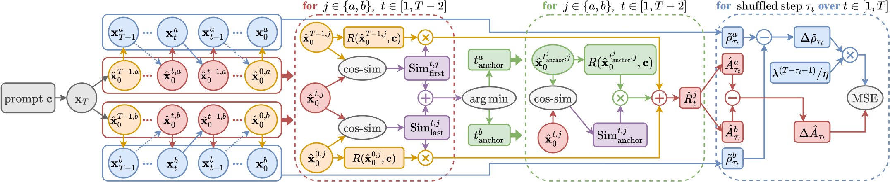
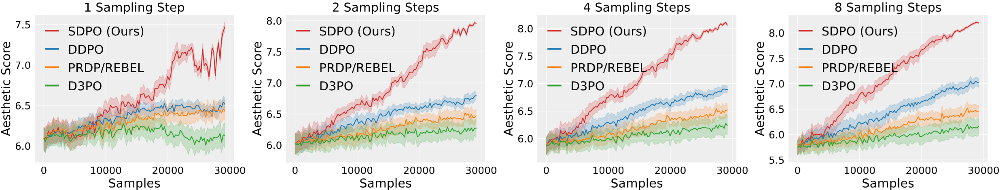

# Stepwise Diffusion Policy Optimization (SDPO)

<div align="left">
<a href="#" target="_blank"></a>
  <a href="https://arxiv.org/pdf/2411.11727" target="_blank"></a>
  <a href="#" target="_blank"></a>
</div>

This repository contains a PyTorch implementation of **Stepwise Diffusion Policy Optimization (SDPO)**, as presented in our paper [*Aligning Few-Step Diffusion Models with Dense Reward Difference Learning*](https://arxiv.org/abs/2411.11727).

## 🔥 News

- **[2026.02]** Our paper has been accepted by **IEEE TPAMI** 🎉🎉🎉

## 📖 Overview

**SDPO** is a novel reinforcement learning framework tailored for aligning few-step diffusion models with downstream objectives.

> Few-step diffusion models enable efficient high-resolution image synthesis but struggle to align with specific downstream objectives due to limitations of existing reinforcement learning (RL) methods in low-step regimes with limited state spaces and suboptimal sample quality. To address this, we propose Stepwise Diffusion Policy Optimization (SDPO), a novel RL framework tailored for few-step diffusion models. SDPO introduces a dual-state trajectory sampling mechanism, tracking both noisy and predicted clean states at each step to provide dense reward feedback and enable low-variance, mixed-step optimization. For further efficiency, we develop a latent similarity-based dense reward prediction strategy to minimize costly dense reward queries. Leveraging these dense rewards, SDPO optimizes a dense reward difference learning objective that enables more frequent and granular policy updates. Additional refinements, including stepwise advantage estimates, temporal importance weighting, and step-shuffled gradient updates, further enhance long-term dependency, low-step priority, and gradient stability. Our experiments demonstrate that SDPO consistently delivers superior reward-aligned results across diverse few-step settings and tasks.

<div align="center">
  
  <p><em>Overall framework of Stepwise Diffusion Policy Optimization (SDPO)</em></p>
</div>

<div align="center">
  
  <p><em>Reward curves for low-step samples in SD-Turbo finetuning</em></p>
</div>

## 🛠️ Installation

To set up this repository, clone it, create a new conda environment, and install all dependencies within it:

```bash
# Clone this repository
git clone https://github.com/ZiyiZhang27/sdpo.git
cd sdpo

# Create and activate a new conda environment (Python 3.10+)
conda create -n sdpo python=3.10 -y
conda activate sdpo

# Install dependencies
pip install -e .

# Configure accelerate based on your hardware setup
accelerate config
```

## 🚀 Quick Start

We provide pre-configured setups for multiple reward functions. Choose one of the following commands to start running SDPO:

- **Aesthetic Score:**

    ```bash
    accelerate launch scripts/train_sdpo.py --config config/config_sdpo.py:aesthetic
    ```

- **ImageReward:**

    ```bash
    accelerate launch scripts/train_sdpo.py --config config/config_sdpo.py:imagereward
    ```

- **HPSv2:**

    ```bash
    accelerate launch scripts/train_sdpo.py --config config/config_sdpo.py:hpsv2
    ```

- **PickScore:**

    ```bash
    accelerate launch scripts/train_sdpo.py --config config/config_sdpo.py:pickscore
    ```

💡 **Tip**: You can modify hyperparameters in the configuration files as needed:

- **[config/base_sdpo.py](config/base_sdpo.py)** - Base configuration with default values
- **[config/config_sdpo.py](config/config_sdpo.py)** - Task-specific configurations

> **Note**: Values in [config/base_sdpo.py](config/base_sdpo.py) override those in [config/config_sdpo.py](config/config_sdpo.py). The default configuration is optimized for 4× GPUs with 24GB+ memory each. Adjust batch sizes and gradient accumulation steps based on your hardware.

## 📝 Citation

If you find this work useful in your research, please consider citing our paper:

```bibtex
@article{zhang2026sdpo,
  title={Aligning Few-Step Diffusion Models with Dense Reward Difference Learning},
  author={Zhang, Ziyi and Shen, Li and Zhang, Sen and Ye, Deheng and Luo, Yong and Shi, Miaojing and Shan, Dongjing and Du, Bo and Tao, Dacheng},
  journal={IEEE Transactions on Pattern Analysis and Machine Intelligence},
  year={2026}
}
```

## 🙏 Acknowledgements

This repository builds upon several excellent open-source projects:

- **[DDPO-PyTorch](https://github.com/kvablack/ddpo-pytorch)** - Foundation for RL-based diffusion model finetuning
- **[D3PO](https://github.com/yk7333/d3po)** - Foundation for DPO-based diffusion model finetuning
- **[RLCM](https://github.com/Owen-Oertell/rlcm)** - [DDPO](https://openreview.net/forum?id=YCWjhGrJFD) and [REBEL](https://github.com/ZhaolinGao/REBEL) implementations for [LCM](https://huggingface.co/SimianLuo/LCM_Dreamshaper_v7) finetuning
- **[ImageReward](https://github.com/THUDM/ImageReward)**, **[HPSv2](https://github.com/tgxs002/HPSv2)**, and **[PickScore](https://github.com/yuvalkirstain/PickScore)** - Reward function implementations

We thank the authors of these projects for their valuable contributions to the community.