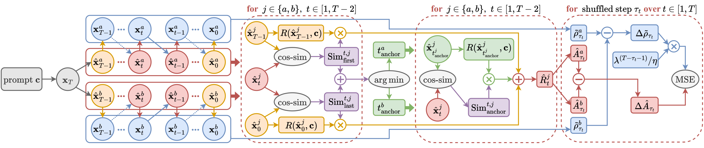
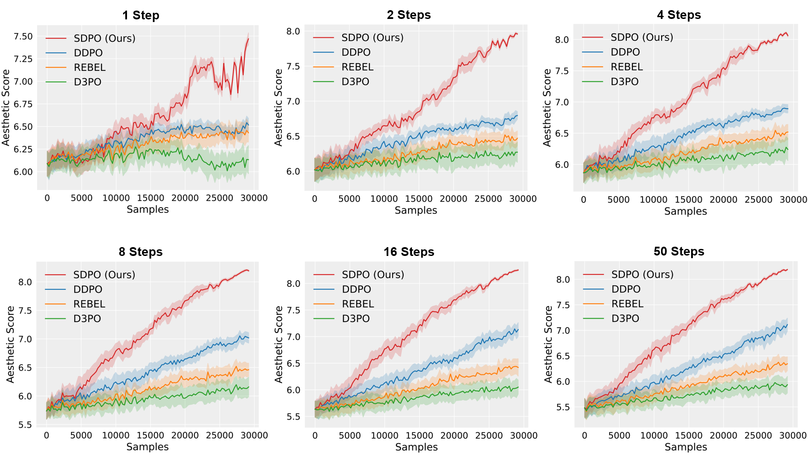

# Stepwise Diffusion Policy Optimization (SDPO)

This is a PyTorch implementation of **Stepwise Diffusion Policy Optimization (SDPO)** from our paper [*Aligning Few-Step Diffusion Models with Dense Reward Difference Learning*](https://arxiv.org/abs/2411.11727).

> Aligning text-to-image diffusion models with downstream objectives (e.g., aesthetic quality or user preferences) is essential for their practical applications. However, standard alignment methods often struggle with ***step generalization*** when directly applied to ***few-step diffusion models***, leading to inconsistent performance across different denoising step scenarios. To address this, we introduce SDPO, which facilitates stepwise optimization of few-step diffusion models through dense reward difference learning, consistently exhibiting superior performance in reward-based alignment across all sampling steps.
>

- **SDPO framework:**



- **Reward curves on Aesthetic Score:**



## Installation

- Python 3.10 or a newer version is required. 

- It is recommended to create a conda environment and install the project dependencies via `setup.py`:

```bash
# Create a new conda environment
conda create -p sdpo python=3.10.12 -y

# Activate the newly created conda environment
conda activate sdpo

# Navigate to the project’s root directory (replace with the actual path)
cd /path/to/project

# Install the project dependencies
pip install -e .
```

## Usage

We use `accelerate` to enable distributed training. Before running the code, ensure `accelerate` is properly configured for your system:

```bash
accelerate config
```

Use the following commands to run SDPO with different reward functions:

- **Aesthetic Score:**

    ```bash
    accelerate launch scripts/train_sdpo.py --config config/config_sdpo.py:aesthetic
    ```

- **ImageReward:**

    ```bash
    accelerate launch scripts/train_sdpo.py --config config/config_sdpo.py:imagereward
    ```

- **HPSv2:**

    ```bash
    accelerate launch scripts/train_sdpo.py --config config/config_sdpo.py:hpsv2
    ```

- **PickScore:**

    ```bash
    accelerate launch scripts/train_sdpo.py --config config/config_sdpo.py:pickscore
    ```

For detailed explanations of the hyperparameters, please refer to the following configuration files:
- `config/base_sdpo.py`
- `config/config_sdpo.py`

These files are pre-configured for training on 4 GPUs, each with at least 24GB of memory. If a hyperparameter is defined in both configuration files, the value in `config/config_sdpo.py` will take precedence.

## Citation

If you find this work useful in your research, please consider citing:

```bibtex
@article{zhang2024sdpo,
  title={Aligning Few-Step Diffusion Models with Dense Reward Difference Learning},
  author={Ziyi Zhang and Li Shen and Sen Zhang and Deheng Ye and Yong Luo and Miaojing Shi and Bo Du and Dacheng Tao},
  journal={arXiv preprint arXiv:2411.11727},
  year={2024}
}
```

## Acknowledgement

- This repository builds upon the [PyTorch implementation of DDPO](https://github.com/kvablack/ddpo-pytorch) developed by [Kevin Black](https://github.com/kvablack) and his team. We sincerely appreciate their contributions to the field.

- We extend our gratitude to the authors of [D3PO](https://github.com/yk7333/d3po) for open-sourcing their work, as well as to [Owen Oertell](https://github.com/Owen-Oertell) for supporting our experiments on [RLCM](https://github.com/Owen-Oertell/rlcm), which includes implementations of [DDPO](https://openreview.net/forum?id=YCWjhGrJFD) and [REBEL](https://arxiv.org/abs/2404.16767) for finetuning [LCM](https://huggingface.co/SimianLuo/LCM_Dreamshaper_v7).

- We also acknowledge the valuable contributions of the [ImageReward](https://github.com/THUDM/ImageReward), [HPSv2](https://github.com/tgxs002/HPSv2), and [PickScore](https://github.com/yuvalkirstain/PickScore) projects to this work.